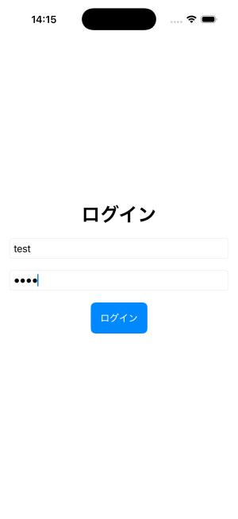
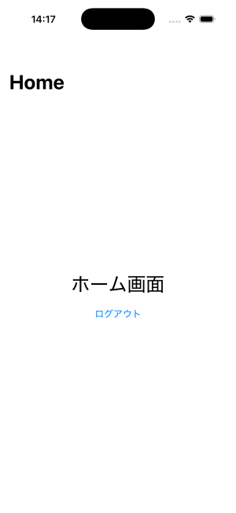
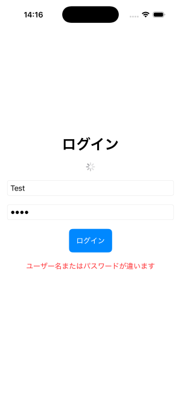

# SwiftUI Login Sample

SwiftUIでログイン画面の基本構成を実装したサンプルアプリです。  

## Screenshot

  
  
  

## Features
- Login Screen
- Login Failure Message
- Screen Transition
- Logout Function
- State Management (@State / @Binding)
- Login State Persistence (UserDefaults)
- Loading Indicator (ProgressView)

## Test Account
username: test
password: 1234
