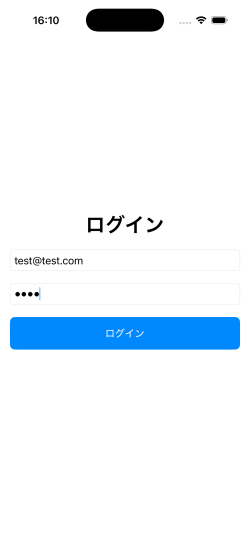
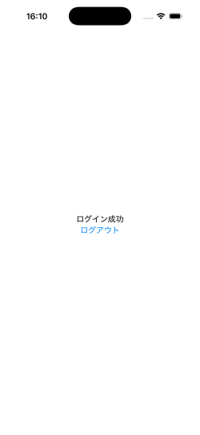
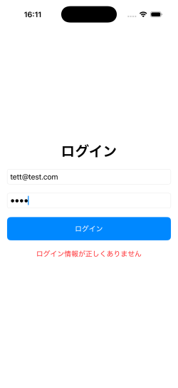

# Login App 🔐

## Screenshot

  
  
  

メールアドレスとパスワードでログインできるシンプルなiOSアプリです。

## 機能
- ログイン
- ログアウト
- ログイン状態の保持

## 技術
- SwiftUI（UI構築）
- MVVM（状態管理）
- UserDefaults（ログイン状態保存）

## 工夫した点
- RootViewでログイン状態による画面分岐を実装
- ViewModelで状態を一元管理し、UIとの分離を実現

## Test Account
username: test@test.com  
password: 1234
