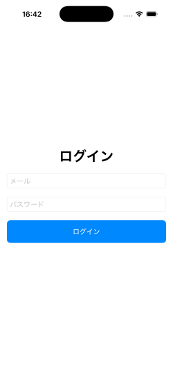
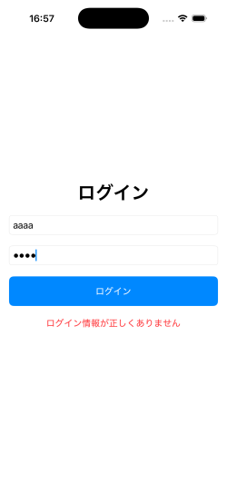

# Login App 🔐（SwiftUI / MVVM）

メールアドレスとパスワードでログインし、ログイン状態を保持できるiOSアプリです。

SwiftUI + MVVMを用いて、状態管理と画面遷移の設計を意識して実装しました。

---

## ■ アプリ概要
ログイン・ログアウト機能を持つシンプルな認証アプリです。  
SwiftUIとMVVMを用いて、状態管理と画面遷移の仕組みを意識して実装しました。

---

## ■ 機能
- ログイン機能
- ログアウト機能
- ログイン状態の保持（アプリ再起動時も維持）
- エラーメッセージ表示
- ローディング表示

---

## ■ 使用技術
- SwiftUI（UI構築）
- MVVM（状態管理）
- @StateObject / @ObservedObject
- UserDefaults（ログイン状態の保存）

---

## ■ アーキテクチャ
- MVVMを採用
- 認証状態（isLoggedIn）をViewModelで一元管理
- RootViewでログイン状態に応じた画面分岐を実装

---

## ■ 工夫した点
- RootViewを導入し、ログイン状態による画面切り替えを実現
- ViewModelにロジックを集約し、Viewと分離
- UserDefaultsを用いてログイン状態を永続化
- ローディング状態を管理し、UXを改善

---

## ■ 苦労した点
- SwiftUIにおける状態管理（@State / @ObservedObject）の理解
- Viewの再描画タイミングによる画面遷移の制御
- ViewModelとのデータ連携

---

## ■ このアプリで学んだこと
- SwiftUIにおける状態管理の重要性
- Viewとロジックを分離する設計（MVVM）
- 状態によってUIを切り替える実装方法

---

## ■ 想定ユースケース
- 認証機能を持つアプリのベース実装
- APIログインへの拡張を想定した設計

---

## ■ 今後の改善
- API通信による実際の認証処理
- バリデーション強化
- UI/UXの改善

---

## ■ 補足
※ 本アプリでは簡易的な認証（ダミーログイン）を使用しています。  
実際のアプリではAPI認証やFirebase Authentication等の利用を想定しています。

---

## ■ 実行方法
1. 本リポジトリをクローン
2. Xcodeでプロジェクトを開く
3. ビルド・実行

---

## ■ 画面イメージ

### ログイン画面

### ホーム画面

